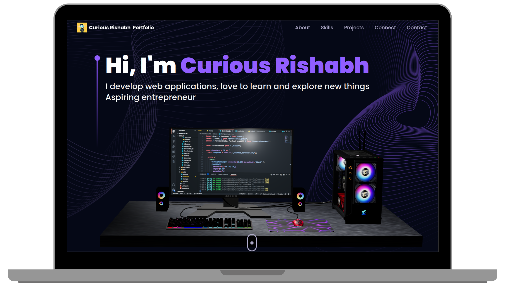

<h2 align="center">
  3D Portfoilo Website 
  <a href="https://curious-rishabh.tech" target="_blank">curious-rishabh.tech</a>
</h2>

  

 

 &nbsp;
 &nbsp;

<h3 align="center">
    🔹
    <a href="https://github.com/curious-rishabh/Rishabh-Portfolio/issues">Report Bug</a> &nbsp; &nbsp;
    🔹
    <a href="https://github.com/curious-rishabh/Rishabh-Portfolio/issues">Request Feature</a>
</h3>

## TL;DR

You can fork this repo to modify and make changes of your own. Please give me proper credit by linking back to [curious-rishabh](https://github.com/curious-rishabh/Rishabh-Portfolio). Thanks!

## Introduction

Portfolio in React JS which uses 3D graphics and animations to bring the content into life. The website is divided into several main sections, including an about, education, project, connect and contact section. Each section is designed to showcase 3D's unique style and creativity, with an emphasis on interactivity and user engagement.

My personal portfolio <a href="https://curious-rishabh.tech" target="_blank">curious-rishabh.tech</a> which features some of my github projects, education as well as my resume and technical skills. 

This project was built using these technologies.

* React.js
* Tailwind CSS
* Three.js
* Framer Motion
* Email.js
* GLTF
* Vite
* VsCode 

## Features

**📖 3D Interactive Models**

**📱 Fully Responsive**

## Getting Started

Clone down this repository. You will need `vite` and `react` installed on your vscode.

## 🛠 Installation and Setup Instructions

1. Setup environment: `npm create vite@latest ./ -- --template react`

2. Install tailwindCss: `npm install -D tailwindcss`

3. Initialise tailwind: `npx tailwindcss init`

4. Additional packages: `npm install --legacy-peer-deps @react-three/fibre @react-three/drei maath react-vertical-timeline-component react-parallax-tilt @emailjs/browser framer-motion react-router-dom`

5. In the project directory, you can run: `npm run dev`

Runs the app in the development mode.\
Open [http://localhost:5173](http://localhost:5173) to view it in the browser.

## Usage Instructions

Open the project folder and Navigate to `/src/components`.  
You will find all the components used and you can edit your information accordingly.

### Show your support

Give a ⭐ if you like this website!

